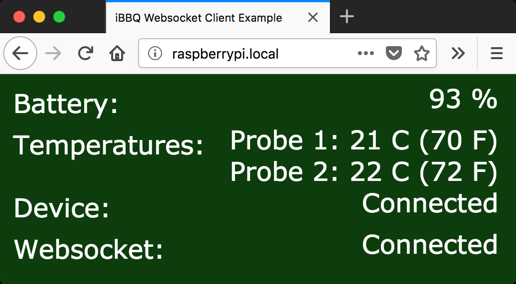

# go-iBBQ Example WebSocket Server



## Building

### Linux

```bash
$ GOOS=linux go build
```

### Linux (Raspberry Pi, etc.)

```bash
$ GOOS=linux GOARCH=arm go build
```

### OS X

```bash
$ GOOS=darwin go build
```

## Usage

In one shell:

```bash
$ LOGXI=main=INF ./ibbq-websocket
02:54:42.923948 INF main Starting websocket server port: 8080
```

In another shell:

```bash
$ curl --include \
    --no-buffer \
    --header "Connection: Upgrade" \
    --header "Upgrade: websocket" \
    --header "Host: localhost:8080" \
    --header "Origin: http://localhost:8080" \
    --header "Sec-WebSocket-Key: SGVsbG8sIHdvcmxkIQ==" \
    --header "Sec-WebSocket-Version: 13" \
    http://localhost:8080/ws
HTTP/1.1 101 Switching Protocols
Upgrade: websocket
Connection: Upgrade
Sec-WebSocket-Accept: qGEgH3En71di5rrssAZTmtRTyFk=

?${"batteryLevel":93,"temps":[21,21]}
?${"batteryLevel":93,"temps":[21,21]}
?${"batteryLevel":93,"temps":[21,21]}
?${"batteryLevel":93,"temps":[21,21]}
?${"batteryLevel":93,"temps":[21,20]}
?${"batteryLevel":93,"temps":[21,21]}
...
```

## Install as a service on Raspberry Pi

(tested successfully on Raspbian 9)

### Create the user and the install directory

(this only needs to be done the first time you install)

```bash
# useradd --comment 'ibbq websocket server user' --system --shell /usr/sbin/nologin ibbq
# mkdir -p /opt/ibbq-websocket
# chown -R ibbq:ibbq /opt/ibbq-websocket
```

### Setup configuration and Systemd service

(this only needs to be done the first time you install)

In `/opt/ibbq-websocket/ibbq-websocket.toml`:
```
port = 80
```

In `/etc/systemd/system/ibbq-websocket.service`:
```
[Unit]
Description=iBBQ Websocket Server
After=network.target

[Service]
Type=simple
User=ibbq
WorkingDirectory=/opt/ibbq-websocket
Environment="LOGXI=main=INF"
ExecStart=/opt/ibbq-websocket/ibbq-websocket
Restart=on-failure
AmbientCapabilities=CAP_NET_BIND_SERVICE CAP_NET_ADMIN CAP_NET_RAW

[Install]
WantedBy=multi-user.target
```

```bash
# systemctl daemon-reload
# systemctl disable bluetooth.service
# systemctl stop bluetooth.service
# systemctl enable ibbq-websocket.service
```

### Install the binary and configure permissions

```bash
# cp ibbq-websocket /opt/ibbq-websocket/ibbq-websocket
# chown -R ibbq:ibbq /opt/ibbq-websocket
```

### Start the service

```bash
# systemctl start ibbq-websocket.service
```
